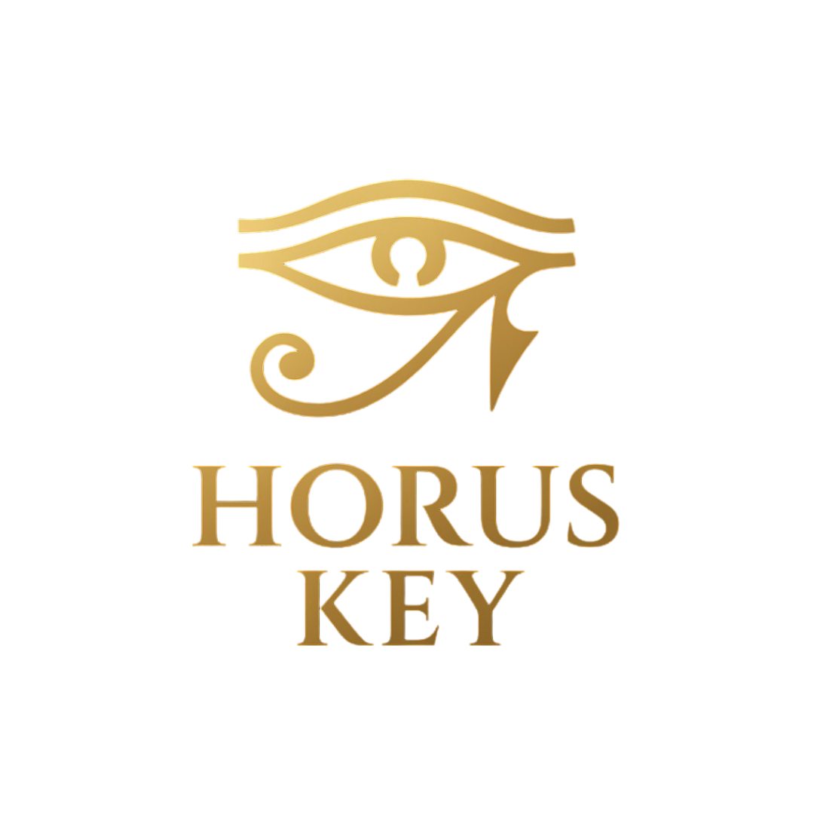
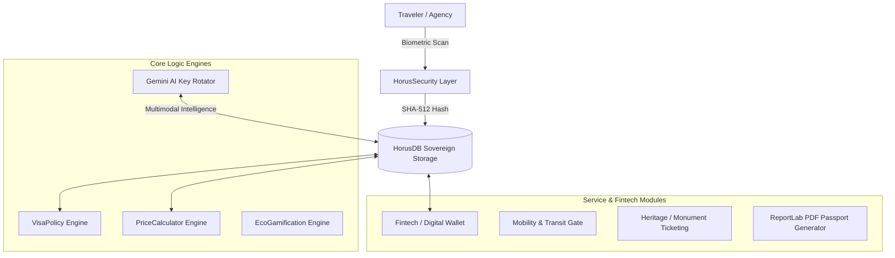

<p align="center">
  
</p>

<h1 align="center">👁️ HORUS KEY: Sovereign Digital Travel & FinTech Ecosystem</h1>

<p align="center">
  <b>A State-of-the-Art (SOTA) Sovereign Modular Monolith for Cryptographic Identity, Border Logic, and Tourism Fintech</b>
</p>

<p align="center">
  
  
  
  
</p>

---

## 📋 Executive Overview

**HORUS KEY** is an enterprise-grade "Modular Monolith" platform engineered to unify border management, tourist identity, digital ticketing, and transit fintech. Designed for zero-trust security and data sovereignty, Horus replaces fragmented paper workflows with an immutable, single-source-of-truth ecosystem.

### Key Innovations:
* **Decoupled Logic Engines:** Policy enforcement (Visa Rules, Dynamic Pricing, Currency Multipliers) is completely decoupled from the presentation layer to ensure immutable rule application.
* **Biometric Zero-Knowledge Hashing:** Facial features are converted directly to non-reversible `SHA-512` hashes—raw biometric images are never stored or transmitted.
* **Smart AI Key Rotation:** Integrated Multimodal AI (Google Gemini 3.0) equipped with automated round-robin key rotation, rate-limit resilience, and context awareness.
* **Integrated Fintech & Reverse QR:** Transforms any device into a secure point-of-sale terminal for instant transit, monument ticketing, and merchant transactions.

---

## 🏗️ System Architecture

HORUS operates as a **Sovereign Single-File Architecture (`HORUSv12.py`)**, maximizing auditability, deployment velocity, and cross-platform portability (Linux, Windows, Docker, Google Colab).



---

## 🛡️ Core Pillars & Capabilities

### 🛂 I. Cryptographic Biometric Identity
* **Algorithm:** `SHA-512` Hashing with salt.
* **Privacy Contract:** Zero-Knowledge architecture. Raw camera frames are analyzed in memory and immediately discarded; only the salted hash (`BIO-8F4A...`) is committed to storage.

### 💳 II. Sovereign Tourist Wallet & Reverse QR
* **Mechanism:** Supports $200 USD minimum activation gates (CBE alignment) and instant peer-to-merchant transfers.
* **Reverse QR Protocol:** Parses encrypted strings (`PAY:VENDOR_ID:AMOUNT:CURRENCY`) for friction-free transit and retail checkout.

### 🏛️ III. Multi-Tier Dynamic Group Ticketing
* **Dynamic Basket Calculations:** Auto-applies discounts for Students (ISIC standard: 50%), Children (30%), and regional Arab/Egyptian subsidies while maintaining price floors.

### 🤖 IV. Multimodal Gemini 3.0 AI Engine
* **Load Distribution:** Automated load-balancing across key pools (`GEMINI_KEYS`).
* **Resilience:** Fallback error handling and automatic model selection (`gemini-2.5-flash` / `gemini-3.0-flash`).

### 🌿 V. Eco-Gamification Engine
* **Green Transit Scoring:** Rewards travelers using sustainable transit (Cairo Monorail, LRT, Electric Buses: +20 pts; Metro: +10 pts) with dynamic marketplace discounts.

---

## 💻 Tech Stack & Dependencies

| Component | Technology | Role |
| :--- | :--- | :--- |
| **Language** | Python 3.10+ | Core Backend & Logic Processing |
| **Database** | Embedded SQLite3 | Local Data Sovereignty & Zero Latency |
| **UI Engine** | Gradio (v4.0+) | Reactive Mobile & Desktop Interface |
| **AI Processing** | Google GenAI SDK | Multimodal Chat & Vision Analysis |
| **Document Engine** | ReportLab | Cryptographic PDF Passport & E-Visa Generation |
| **Vision & Scanning** | OpenCV & PyZBar | Real-time QR Code & Camera Processing |

---

## 🚀 Quickstart & Deployment

### 1. Environment Setup

```bash
# Clone repository
git clone https://github.com/G3need/horus.git
cd horus

# Install core dependencies
pip install gradio qrcode reportlab google-genai opencv-python pyzbar
```

### 2. Configure API Keys

Set your Google Gemini API key(s) in your environment (multiple keys can be comma-separated for automatic load balancing):

```bash
# Linux / macOS
export GEMINI_KEYS="AIzaSyYourKey1...,AIzaSyYourKey2..."

# Windows (Command Prompt)
set GEMINI_KEYS=AIzaSyYourKey1...,AIzaSyYourKey2...

# Windows (PowerShell)
$env:GEMINI_KEYS="AIzaSyYourKey1...,AIzaSyYourKey2..."
```

### 3. Launch HORUS

```bash
python HORUSv12.py
```

Open the generated local URL (e.g. `http://127.0.0.1:7860`) in your browser.

---

## ⚖️ Compliance & Legal Framework

1. **Egyptian Data Protection Law:** Encrypted at rest, zero raw biometric storage.
2. **Central Bank of Egypt (CBE) Financial Guidelines:** Structured audit logging and transaction non-repudiation.
3. **Ministry of Tourism & Antiquities:** Hardcoded pricing floors and automated regional subsidy calculation.

---

<p align="center">
  <b>Architect:</b> Ahmed Geneed (Mohamed Sayed Ahmed)<br/>
  <b>Copyright Registry Submission – Arab Republic of Egypt (2026)</b>
</p>
